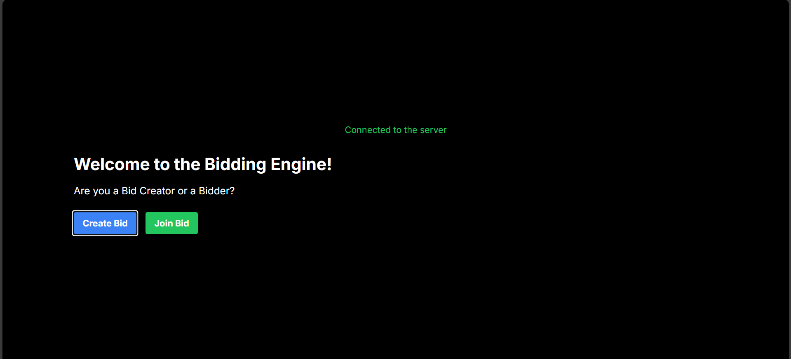
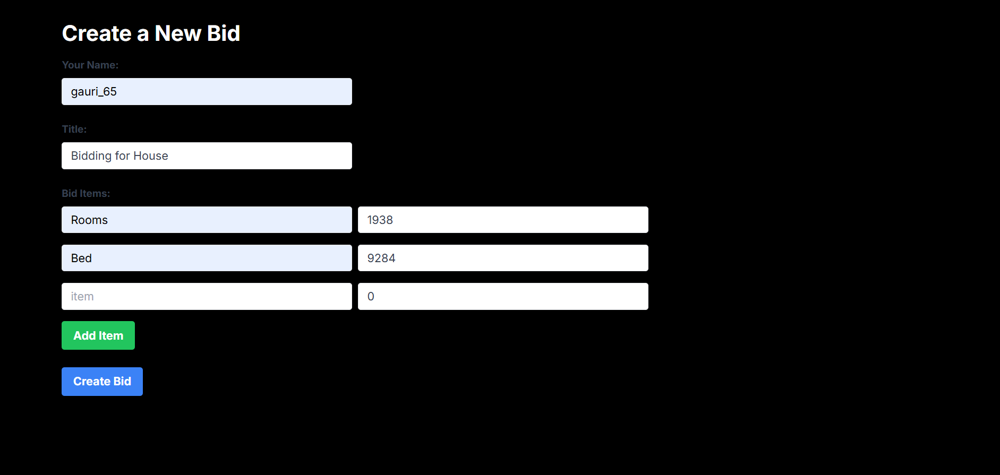
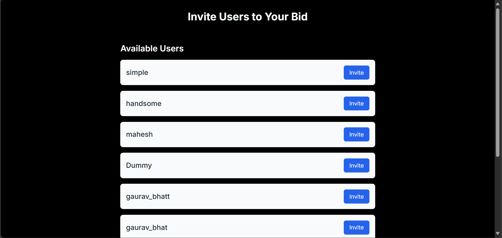
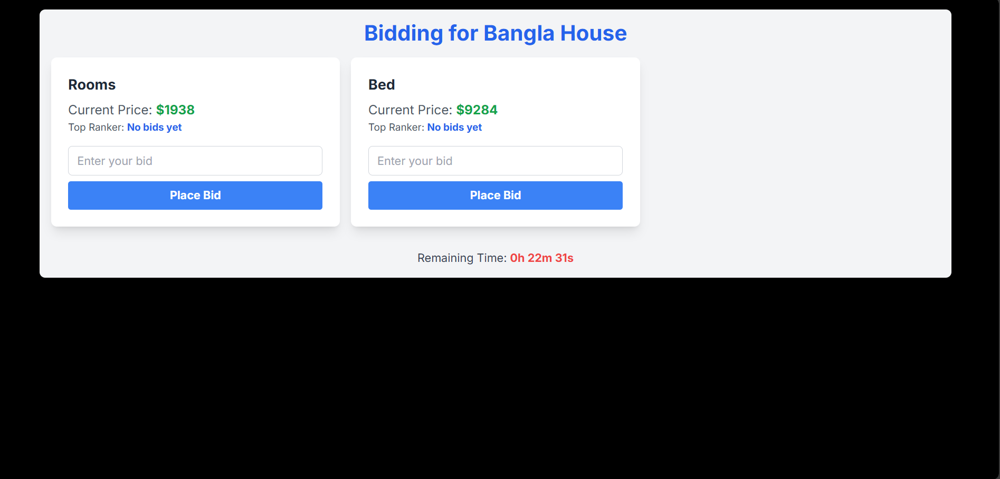

# Real-Time Collaborative Bidding Engine - Full Documentation



## Overview

This document describes the full implementation of a real-time collaborative bidding engine, including both the backend (Node.js, Express.js, Socket.io, MongoDB) and the frontend (Next.js). The engine allows Bid Creators to create and manage bids, while Bidders can participate in these bids in real-time.

## Running locally

# Prerequisites

- **Node.js and npm (or yarn):** Make sure you have Node.js and npm (or yarn) installed on your system.
- **MongoDB:** You need a running MongoDB instance. You can install it locally or use a cloud-based MongoDB service.

### Backend Setup

1. **Navigate to the backend directory:**
   ```bash
   cd server
   ```
2. **Install Dependencie**
   ```
   npm install
   ```
3. **Create a .env file: Create a .env file in the server directory and add your MongoDB connection URI:**
   ```
   MONGO_URI=mongodb://localhost:27017/
   PORT : 8000
   ```
4. **Start the server:**

   ```
   nodemon src/server.ts

   ```

   ###Frontend Setup

5. **Navigate to the backend directory:**
   ```bash
   cd client
   ```
6. **Install Dependencie**
   ```
   npm install
   ```
7. **Start the server:**

   ```
   npm run dev

   ```

## Technology Stack

**Backend:**

- **Node.js:** JavaScript runtime environment.
- **Express.js:** Web framework for Node.js.
- **Socket.io:** Enables real-time, bidirectional communication between the server and clients.
- **MongoDB:** NoSQL database for storing bid data and user information.
- **Mongoose:** Object Data Modeling (ODM) library for MongoDB and Node.js.
- **TypeScript:** Statically typed superset of JavaScript.

**Frontend:**

- **Next.js:** React framework for building server-rendered and static web applications.
- **React:** JavaScript library for building user interfaces.
- **Socket.io Client:** Client-side library for connecting to Socket.io servers.

## User Flow

**Bid Creator:**

1. **Create Bid:** Uses the `Create Bid` page to create a new bid.
   
2. **Manage Bids:** Uses the `Creator Dashboard` to view, publish, and manage created bids.
   
3. **Invite Bidders:** Uses the `Invite Bidders` page to invite specific bidders to a bid.
   
   **Bidder:**

4. **View Bids:** Uses the `Bidder Dashboard` to view available bids.
   
5. **Accept Bids:** Accepts bids they are interested in participating in.
6. **Receive Invitations:** Receives invitations from Bid Creators and can choose to accept or reject them.
   

## Real-time Bid Updates


The application leverages Socket.io to provide real-time updates on bid amounts and the highest bidder. The following events and handlers are used:

**Backend (server.ts):**

- **`updateBidItem` (Event Handler):** Broadcasts the `bidUpdate` event to all clients in a specific bid room when a bidder updates their bid.

**Frontend (ongoing-bids/[bidId]/page.tsx):**

- **`bidUpdate` (Event Listener):** Listens for the `bidUpdate` event and updates the bid data in the component's state, triggering a re-render to reflect the changes in real-time.

## Data Models (Same as Backend)

- **`Bid`:**

  - `title`: String - The title of the bid.
  - `creator`: ObjectId - Reference to the user who created the bid.
  - `items`: Array of objects - Each object represents a bid item with a name, description, and starting price.
  - `startTime`: Date - The scheduled start time of the bid.
  - `endTime`: Date - The scheduled end time of the bid.
  - `isPublished`: Boolean - Indicates whether the bid is published and live.
  - `bidders`: Array of ObjectIds - References to the users who are participating in the bid.

- **`User`:**
  - `username`: String - The username of the user.
  - `role`: String - The role of the user ("BidCreator" or "Bidder").
  - `bids`: Array of ObjectIds - References to the bids the user is participating in.

## API Endpoints (Same as Backend)

| Method | Endpoint              | Description                                |
| ------ | --------------------- | ------------------------------------------ |
| GET    | `/get-bids/:creator`  | Get all bids for a specific creator.       |
| GET    | `/getAllBids`         | Get all bids.                              |
| GET    | `/bidders`            | Get all bidders.                           |
| GET    | `/getBid/:bidId`      | Get a single bid by ID.                    |
| POST   | `/finalizeBid/:bidId` | Finalize a bid.                            |
| POST   | `/create-bid`         | Create a new bid.                          |
| POST   | `/createBidder`       | Create a new bidder.                       |
| POST   | `/invite-bidders`     | (Not implemented) Invite bidders to a bid. |
| POST   | `/publish-bid`        | Publish a bid.                             |

## Conclusion

This documentation provides an overview of a real-time collaborative bidding engine implemented using Node.js, Express.js, Socket.io, MongoDB, and Next.js. While the core functionality is in place, there are opportunities for further enhancements to create a more complete and robust bidding platform.
